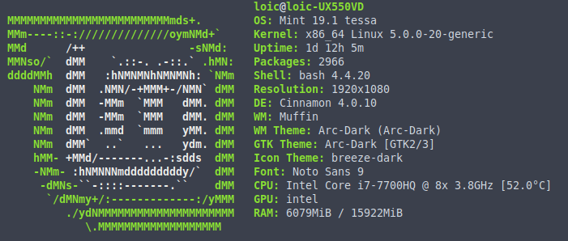

# RES_HTTPInfra
L'objectif principal de ce laboratoire est de se familiariser avec les outils qui vont nous permettre de monter une infrastructure web complète. Nous allons créer petit à petit un environnement qui va permettre de servir des page web statique et dynamique. Pour ce faire nous allons utiliser le serveur httpd Apache qui permet de faire à la fois server HTTP et reverse proxy. Nous allons aussi découvrir le javascript avec le framework express.js pour créer des applications web dynamiques.

Dans un second temps, nous allons mettre en place un système plus avancé qui permettra à notre reverse proxy de faire du load balancing et de gérer des sticky sessions. Nous allons aussi mettre en place un système de gestion dynamique de nos cluster afin de pouvoir effectuer des changements à chaud sur notre infrastructure. Puis, nous terminerons avec un interface web qui nous permettra de directement gérer l'ensemble de nos container docker.

# Caractéristiques de l'OS
Voici les caractéristiques de l'OS utilisé pour la réalisation de ce laboratoire

# Fonctionnement du repository
Voici les différentes étapes réalisées

1. [Etape 1: Serveur HTTP static avec apache httpd](https://github.com/gollgot/RES_HTTPInfra/tree/fb-apache-static)
2. [Etape 2: Serveur HTTP dynamique avec express.js](https://github.com/gollgot/RES_HTTPInfra/tree/fb-express-dynamic)
3. [Etape 3: Reverse proxy avec apache (configuration statique)](https://github.com/gollgot/RES_HTTPInfra/tree/fb-apache-reverse-proxy)
4. [Etape 4: Requête AJAX avec JQuery](https://github.com/gollgot/RES_HTTPInfra/tree/fb-ajax-jquery)
5. [Etape 5: Configuration dynamique du reverse proxy](https://github.com/gollgot/RES_HTTPInfra/tree/fb-dynamic-configuration)
6. [Etape supplémentaire 1: Load balancing -> multiple noeuds](https://github.com/gollgot/RES_HTTPInfra/tree/fb-load-balancer)
7. [Etape supplémentaire 2: Load balancing -> Sticky sessions VS Round-Robin](https://github.com/gollgot/RES_HTTPInfra/tree/fb-load-balancer-sticky-vs-rr)
8. [Etape supplémentaire 3: Dynamic cluster management](https://github.com/gollgot/RES_HTTPInfra/tree/fb-dynamic-management)
9. [Etape supplémentaire 4: Management UI](https://github.com/gollgot/RES_HTTPInfra/tree/fb-management-ui)

Chaque étape reprend le travail de la précédente, nous vous recommandons donc de suivre une a une, dans cet ordre les étapes. Chaque étape est une branche et vous retrouverez un README.md vous expliquant tout ce qu'il faut savoir concernant l'étape en cours.